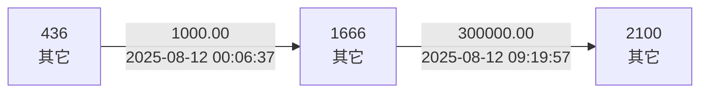
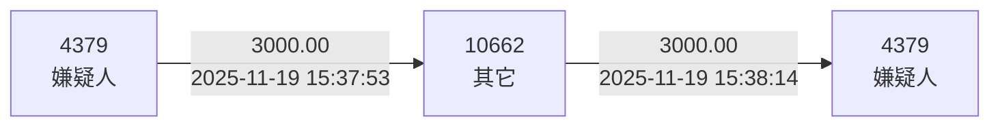
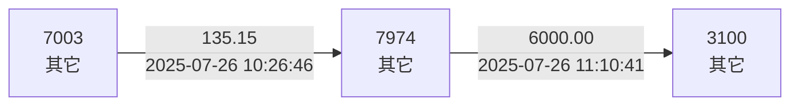
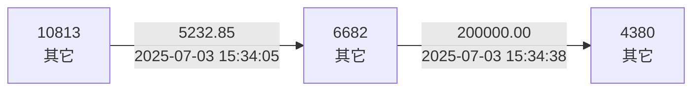

# 链路可视化样例

以下 Mermaid 图可直接复制到支持 Mermaid 的 Markdown 或 PPT 工具中渲染。

## 账户 436

## 账户 880

## 账户 1802

## 账户 4379

## 账户 4587

## 账户 4630

## 账户 5093

## 账户 6237

## 账户 6625

## 账户 7003

## 账户 8275

## 账户 9198

## 账户 9279

## 账户 9928

## 账户 10083

## 账户 10751

## 账户 10813

