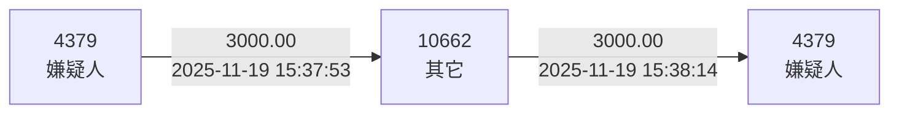
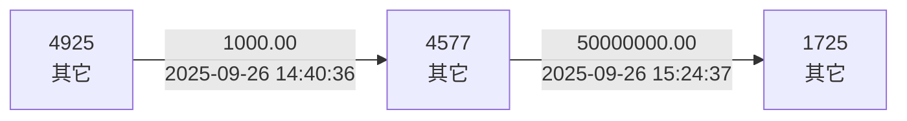
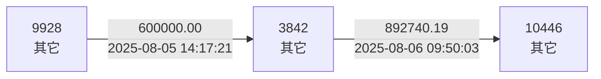

# 链路可视化样例

以下 Mermaid 图可直接复制到支持 Mermaid 的 Markdown 或 PPT 工具中渲染。

## 账户 880

```mermaid
flowchart LR
  A["880\n其它"] -->|"972.00\n2025-08-14 16:41:30"| B["7863\n其它"]
  B -->|"228.00\n2025-08-15 15:07:45"| C["5754\n其它"]
```

## 账户 4379

```mermaid
flowchart LR
  A["4379\n嫌疑人"] -->|"3000.00\n2025-11-19 15:37:53"| B["10662\n其它"]
  B -->|"3000.00\n2025-11-19 15:38:14"| C["4379\n嫌疑人"]
```

## 账户 4925

```mermaid
flowchart LR
  A["4925\n其它"] -->|"1000.00\n2025-09-26 14:40:36"| B["4577\n其它"]
  B -->|"50000000.00\n2025-09-26 15:24:37"| C["1725\n其它"]
```

## 账户 6625

```mermaid
flowchart LR
  A["6625\n其它"] -->|"359141.44\n2025-08-28 09:39:05"| B["8688\n其它"]
  B -->|"24637.00\n2025-08-28 15:22:03"| C["1626\n其它"]
```

## 账户 6739

```mermaid
flowchart LR
  A["6739\n其它"] -->|"7473523.00\n2025-09-18 10:52:12"| B["9429\n其它"]
  B -->|"45000000.00\n2025-09-18 16:37:51"| C["6475\n其它"]
```

## 账户 8713

```mermaid
flowchart LR
  A["8713\n其它"] -->|"272.00\n2025-09-11 11:36:18"| B["4185\n其它"]
  B -->|"400.00\n2025-09-11 15:19:59"| C["3754\n其它"]
```

## 账户 9365

```mermaid
flowchart LR
  A["9365\n其它"] -->|"200000.00\n2025-08-19 09:30:43"| B["5918\n其它"]
  B -->|"7873.70\n2025-08-19 10:56:30"| C["63\n受害人"]
```

## 账户 9544

```mermaid
flowchart LR
  A["9544\n其它"] -->|"27544.00\n2025-09-10 16:04:23"| B["512\n其它"]
  B -->|"67000.00\n2025-09-10 16:34:28"| C["9608\n其它"]
```

## 账户 9928

```mermaid
flowchart LR
  A["9928\n其它"] -->|"600000.00\n2025-08-05 14:17:21"| B["3842\n其它"]
  B -->|"892740.19\n2025-08-06 09:50:03"| C["10446\n其它"]
```

## 账户 10083

```mermaid
flowchart LR
  A["10083\n其它"] -->|"10950547.50\n2025-07-10 14:30:10"| B["2325\n其它"]
  B -->|"7500753.66\n2025-07-10 15:26:05"| C["10485\n其它"]
```
