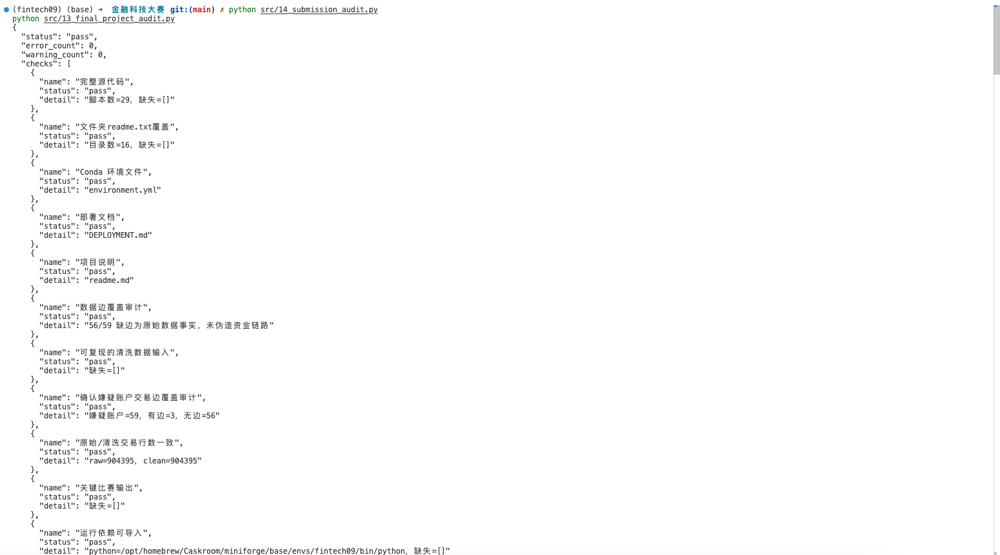
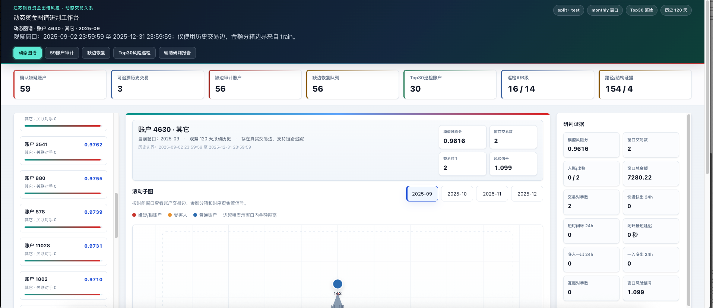
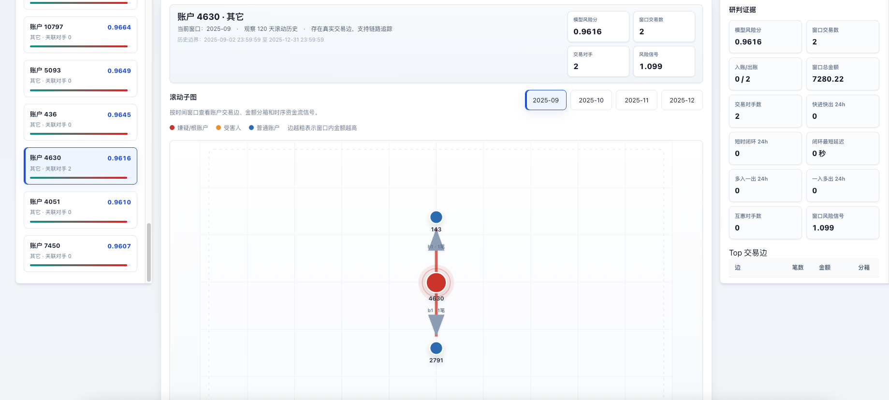
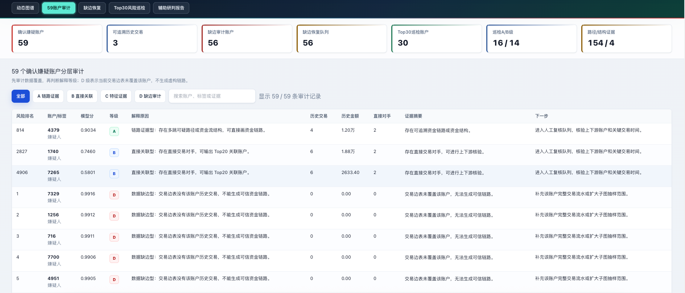
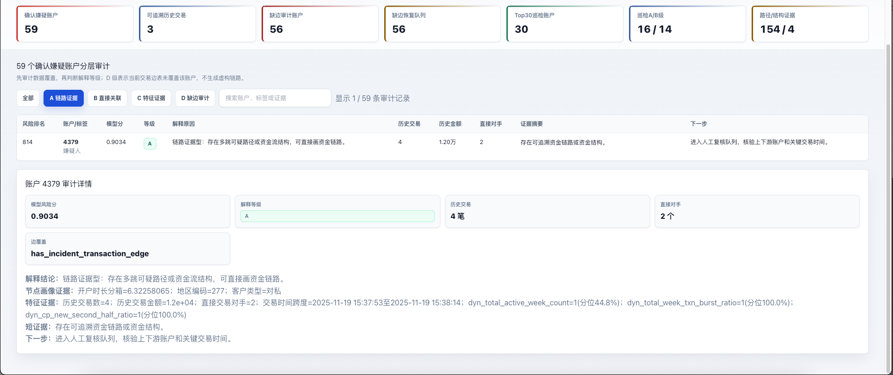
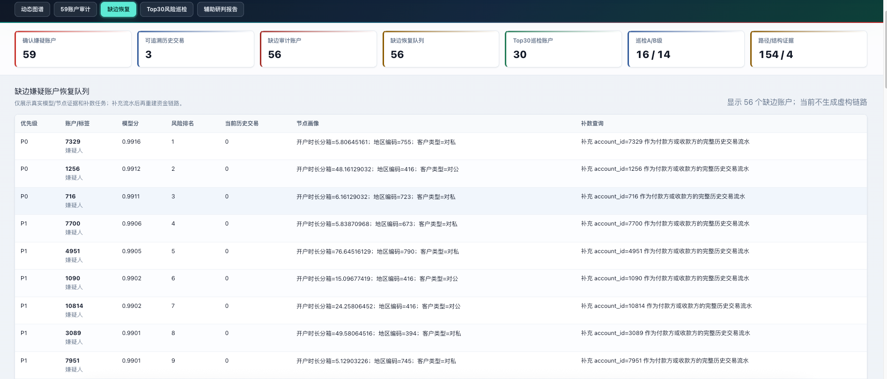
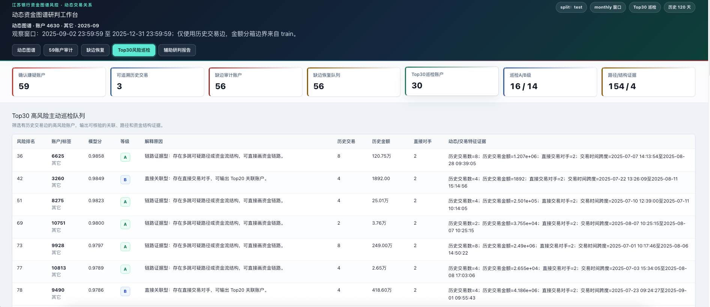
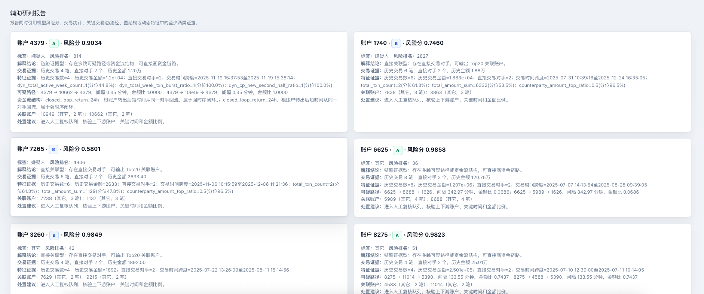

# 项目演示与使用说明

第五届中国研究生金融科技创新大赛 · “揭榜挂帅”主赛道
赛题：基于资金图谱的涉诈账户发现与可疑链路解释（江苏银行）
主模型：model11_validation_selected_best_strategy_A 动态资金图谱融合模型

## 1. 项目一句话

本项目以脱敏账户和交易边为核心，构建按时间窗口演化的动态资金图谱，先识别高风险涉诈账户，再对有交易边的账户输出可追溯资金链路，对无交易边的账户输出缺边审计与补数恢复队列，不伪造任何路径证据。

## 2. 核心成果一览

| 任务 | 成果 | 关键指标 |
|---|---|---|
| 任务1 | 动态资金图谱样本构建 | 未来交易泄露为 0 |
| 任务2 | 涉诈账户风险识别 | Test AUC 0.9858，PR-AUC 0.8049，Top5% 覆盖 56/59 |
| 任务3 | 关联账户与资金链路解释 | Top20 关联、多跳路径、资金结构；人工抽检 5/5 通过 |
| 任务4 | 辅助研判报告生成 | 报告至少引用两类可追溯证据 |

## 3. 项目怎么使用

### 3.1 安装环境

```bash
conda env create -f environment.yml
conda activate fintech09
```

### 3.2 快速查看已交付结果

不重新训练模型，直接运行两项审计即可确认项目完整可运行：

```bash
python src/14_submission_audit.py
python src/13_final_project_audit.py
```

两个命令均输出 `status: pass`、`error_count: 0`。



### 3.3 完整复现

从原始数据清洗到最终模型，按 `src/01_data_cleaning.py` 至 `src/26_data_edge_coverage_audit.py` 的顺序运行即可，完整命令见根目录 `DEPLOYMENT.md`。

### 3.4 主要目录

- `deliverables/`：四项任务的最终交付物和审计结果，提交作品时上传该目录
- `outputs/`：清洗数据、特征、指标、预测、解释和动态网页
- `models/`：模型权重与 SHA-256 清单
- `src/`：全部源代码
- `docs/`：技术文档、审计报告和本演示文档

## 4. 网页怎么看

### 方式一：直接双击打开

双击 `outputs/dynamic_graph/index.html` 即可。页面数据已内嵌，不依赖后端服务；首次打开建议联网，以便正常加载样式。

### 方式二：本地 HTTP 服务

```bash
cd outputs/dynamic_graph
python -m http.server 8080
```

然后在浏览器打开 `http://localhost:8080/`。



## 5. 网页使用说明

页面顶部展示观察窗口、时间范围和 5 个功能页签。核心指标栏显示确认嫌疑账户、可追溯历史交易、缺边审计账户、缺边恢复队列、Top30 巡检账户等数量。

### 5.1 动态图谱页

- 左侧“高风险账户”：点击账户切换当前查看对象
- 中间“滚动子图”：点击时间窗口按钮切换 2025-09 至 2025-12
- 图例：红色为嫌疑/根账户，橙色为受害人，蓝色为普通账户；边越粗表示窗口内金额越高
- 下方“窗口轨迹”：查看各窗口交易数、对手数、快进快出、短时闭环和风险信号
- 右侧“研判证据”和“Top 交易边”：查看当前账户的关键证据



### 5.2 59 账户审计页

- 使用“全部 / A 链路证据 / B 直接关联 / C 特征证据 / D 缺边审计”按钮筛选
- 在搜索框输入账户、标签或证据关键词
- 点击任意一行，下方显示该账户的审计详情





### 5.3 缺边恢复页

- 展示 56 个无交易边嫌疑账户的恢复优先级、模型分、风险排名、节点画像和补数查询
- 点击任意一行，下方显示补数后应重建的链路类型



### 5.4 Top30 风险巡检页

- 展示有历史交易边的高风险账户
- 点击任意一行，下方显示 Top20 关联账户、可疑多跳路径和资金流结构
- 若账户在动态图谱 Top30 内，可点击“查看该账户滚动动态图谱”跳回图谱页



### 5.5 辅助研判报告页

- 上方为报告卡片，展示模型分、标签、交易证据、特征证据、可疑路径和处置建议
- 下方“报告原文”为可直接复制给业务复核的 Markdown 文本


