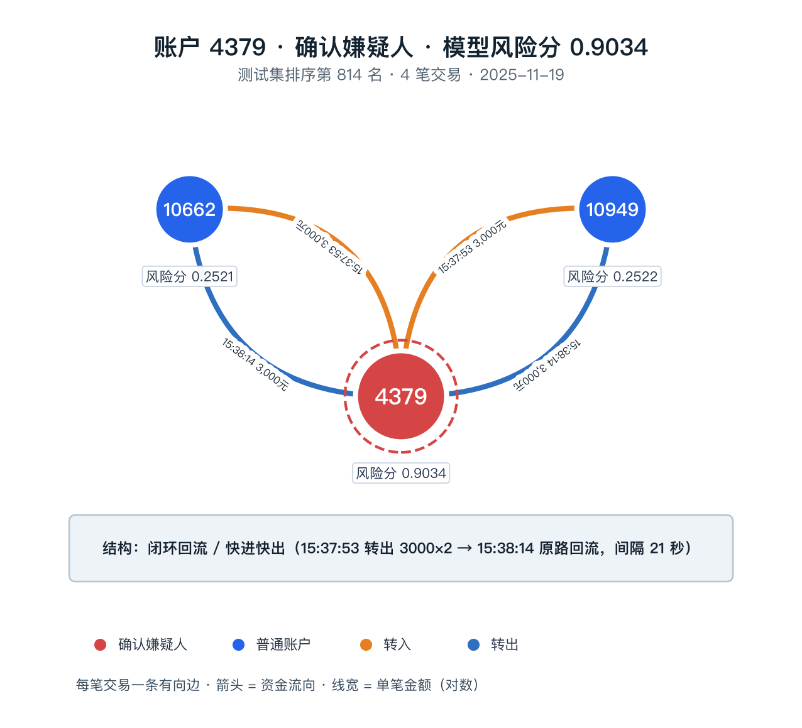
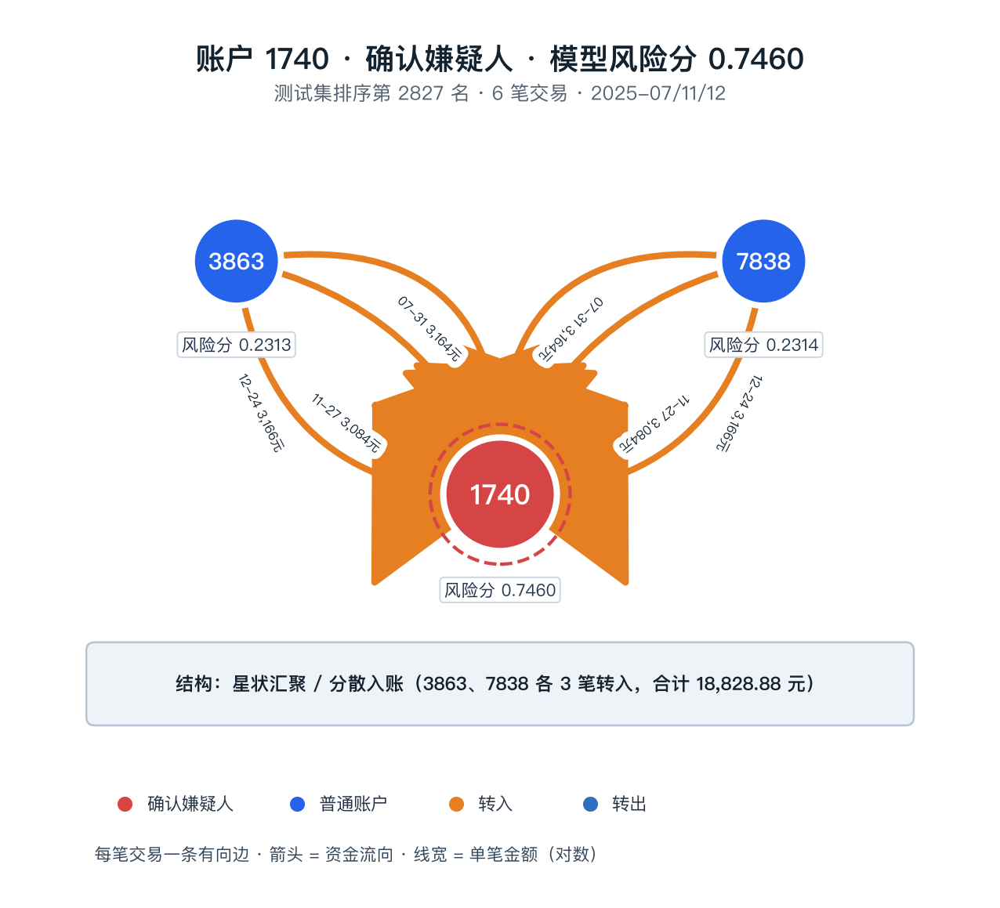
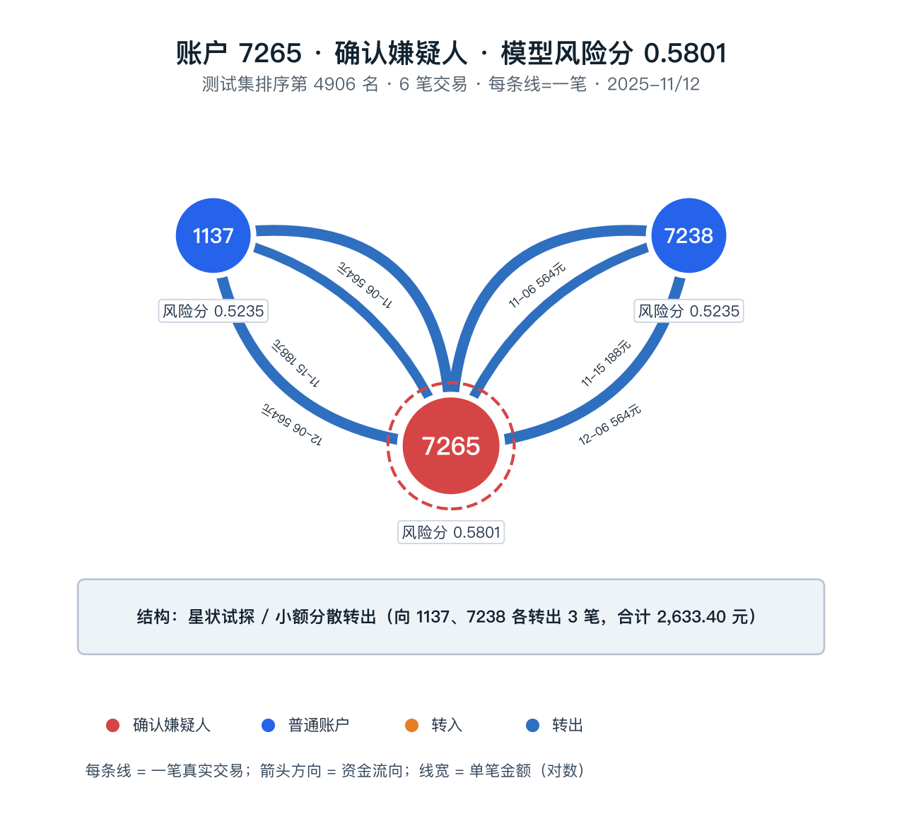
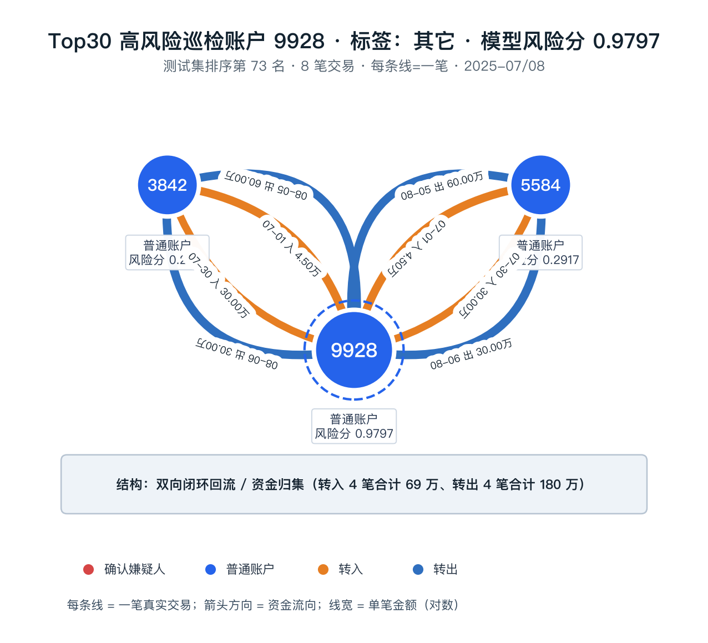

# 附录 D 资金图谱可视化与缺边审计

> 本文件供队友共享与答辩引用。以下图谱全部基于本项目测试集真实数据生成，不引用外部业务案例（CASE-001 至 CASE-005 仅用于正文第四章业务知识说明）。

## 图 D-1 账户 4379（确认嫌疑人）资金链路子图：闭环回流结构

**说明：** 账户 4379 模型风险分 0.9034，测试集排序第 814 名，标签为确认嫌疑人。2025-11-19 15:37:53 向 10662、10949 各转出 3000 元，15:38:14 两笔资金原路回流，间隔仅 21 秒。红色节点为确认嫌疑人，蓝色节点为普通账户，箭头表示资金方向，边宽按金额对数缩放。识别结构类型：**闭环回流/快进快出（快速分散与归集模体）**。

## 图 D-2 账户 1740（确认嫌疑人）资金链路子图：分散入账/星状汇聚

**说明：** 账户 1740 模型风险分 0.7460，测试集排序第 2827 名。3863、7838 两个固定对手在 2025-07、2025-11、2025-12 三期分别向 1740 转入约 3084.40-3166.04 元，共 6 笔、合计 18828.88 元，呈稳定星状汇聚结构，符合资金池沉淀特征。

## 图 D-3 账户 7265（确认嫌疑人）资金链路子图：小额分散转出

**说明：** 账户 7265 模型风险分 0.5801，测试集排序第 4906 名。账户向 1137、7238 两个固定对手重复转出 188.10-564.30 元，共 6 笔、合计 2633.40 元，呈小额星状试探结构，符合养号/鉴权测试阶段的低金额分散特征。

## 图 D-4 Top30 高风险巡检账户 9928 关联网络拓扑：双向闭环回流

**说明：** 账户 9928 模型风险分 0.9797，进入 Top30 高风险巡检队列，标签为其它。3842、5584 与其在 2025-07、2025-08 反复互转，转入合计 690000 元、转出合计 1800000 元，金额逐笔放大，呈双向闭环回流/资金归集结构，属于值得人工复核的高风险关联网络。

## 图例与口径说明

节点颜色：**红色=确认嫌疑人，橙色=受害人，蓝色=其它**；节点内显示账户 ID、标签与模型风险分；箭头表示资金方向；边宽表示合计金额（对数缩放），边标签显示笔数与合计金额或单笔时间。所有图谱只使用截至测试期截止（2025-12-31）的历史交易，未使用未来交易。

## 数据局限与缺边审计

需要明确说明：59 个确认嫌疑账户中仅有 3 个（4379、1740、7265）在脱敏交易边表内存在真实交易边，其余 56 个账户在交易边表中无任何入边或出边。该缺边是原始抽样数据的客观事实，与清洗规则、ID 类型或时间窗口过滤无关；本项目不伪造路径，而是输出模型分数、节点画像、缺边审计与补数查询。表 D-1 为缺边审计记录样例。

### 表 D-1 缺边审计记录样例（排名前 6 的确认嫌疑人）

| 账户ID | 模型风险分 | 测试集排序 | 历史交易数 | 解释等级 | 边覆盖状态 | 证据说明 |
|---|---:|---:|---:|---|---|---|
| 7329 | 0.9916 | 1 | 0 | D | 未出现于交易边表 | 交易边表未覆盖该账户，无法生成可信链路 |
| 1256 | 0.9912 | 2 | 0 | D | 未出现于交易边表 | 交易边表未覆盖该账户，无法生成可信链路 |
| 716 | 0.9911 | 3 | 0 | D | 未出现于交易边表 | 交易边表未覆盖该账户，无法生成可信链路 |
| 7700 | 0.9906 | 4 | 0 | D | 未出现于交易边表 | 交易边表未覆盖该账户，无法生成可信链路 |
| 4951 | 0.9905 | 5 | 0 | D | 未出现于交易边表 | 交易边表未覆盖该账户，无法生成可信链路 |
| 1090 | 0.9902 | 6 | 0 | D | 未出现于交易边表 | 交易边表未覆盖该账户，无法生成可信链路 |

**说明：** 解释等级 D 表示数据缺边型，不生成任何推测链路；完整 59 账户审计见 `outputs/explanations/layered/confirmed_suspect_explainability_audit.csv` 与 `docs/confirmed_suspect_explainability_audit.md`。缺边账户不代表模型没有风险判断，其风险分来自账户画像与图基座特征；账户级五折留出验证 Top5% 召回约 44%，应作为补数复核线索，补齐外部设备/IP/开户批次等关联后再重建真实资金链路。

## 数据来源与可复现

- 图谱图片：`docs/images/appendix_d_4379_loop.png`、`appendix_d_1740_star.png`、`appendix_d_7265_star.png`、`appendix_d_9928_flow.png`
- 交易数据：`outputs/clean/clean_transactions.csv`
- 模型分数：`outputs/predictions/model11_validation_selected_best_strategy_A.csv`
- 缺边审计：`outputs/explanations/layered/confirmed_suspect_explainability_audit.csv`、`outputs/explanations/layered/suspect_link_recovery_queue.csv`
- 可复现命令：`python src/26_data_edge_coverage_audit.py`（边覆盖审计）、`python src/09_dynamic_graph_viz.py`（动态图谱页面）
